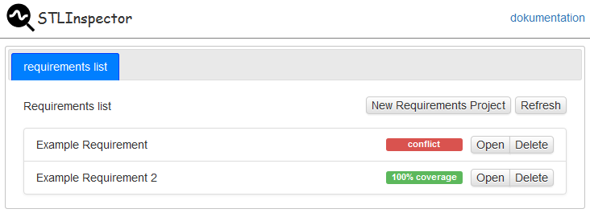
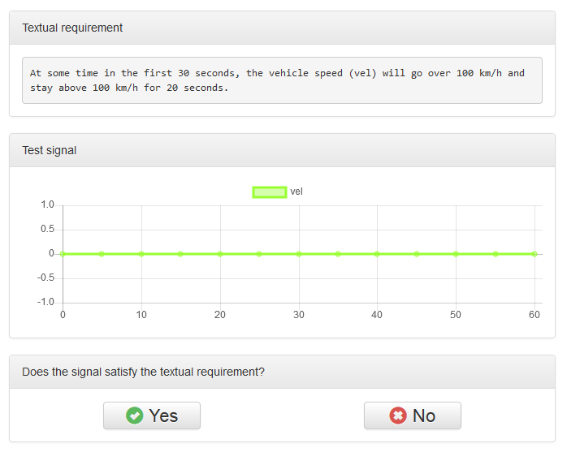

# STLInspector

## Introduction

STLInspector is a tool for systematic validation of Signal Temporal Logic (STL)
        specifications against informal textual requirements. Its goal is to
        identify typical faults that occur in the process of formalizing
        requirements by mutating a candidate specification. STLInspector
        computes a series of representative signals that enables a requirements
        engineer to validate a candidate specification against all its mutated
        variants, thus achieving full mutation coverage. By visual inspection of
        the signals via a web-based GUI, an engineer can obtain high confidence
        in the correctness of the formalization - even if she is not familiar
        with STL. STLInspector makes the assessment of formal specifications
        accessible to a wide range of developers in industry, hence contributes
        to leveraging the use of formal specifications and computer-aided
        verification in industrial practice.

STLInspector is based on [Z3], [antlr], [bootstrap], [Chart.js],
             [Handlebars.js], [jQuery], [jQuery UI], [Flask], and [Flask-Assets].

[Z3]:https://github.com/Z3Prover/z3
[antlr]:http://www.antlr.org/
[bootstrap]:http://getbootstrap.com
[Chart.js]:http://www.chartjs.org/
[Handlebars.js]:http://handlebarsjs.com/
[jQuery]:https://jquery.com/
[jQuery UI]:https://jqueryui.com/
[Flask]:http://flask.pocoo.org/
[Flask-Assets]:https://flask-assets.readthedocs.io/en/latest/

## Tutorial

This is a tutorial that demonstrates how to use [STLInspector](http://github.com/STLInspector/STLInspector). It shows the standard workflow of the program with an example requirement.

1. Start the server by executing `stlinspector .`.
2. Open a browser and go to [http://localhost:5000](http://localhost:5000).
3. Press the *new requirements project* button, input the title *tutorial
   requirements project* and press the *add* button. The project overview opens.
4. In the *textual requirements* block press the *edit* button and input:

    > The velocity should be higher than 5km/h from second 1 to second 3.

5. In the *current STL candidate* block press the *edit* button and input:

    > F[1,3] velocity > 5                                                       

6. Under *visual inspection results* replace *Name* with *Test User* and press
*new visual inspection*.
7. The textual requirement and a test signal is shown. Evaluate the textual
requirement on the test signal and press the *yes* or *no* button. Do this until
no test signals are shown any more. Then press *go back to project overview*.
8. To see the evaluation results, press the *show results* button. Since in our
example the STL candidate is wrong, some of your evaluation results should
differ from the STL candidate results.
9. Change the STL candidate to:

    > G[1,3] velocity > 5                                                       

10. Redo the visual inspection on the new STL candidate.
11. You should not get conflicting evaluation results for the STL candidate now.
12. Press the save button and the project is saved to `tutorial_requirements_project.stlinspector` in the current directory.
Congratulations, you validated the STL candidate against the textual
requirement!
	
## Web-based GUI User's Guide

STLInspector comes with a web-based grafical user interface. It can be started by running the command:
```
stlinspector <datadir>
``` 

The output should look similar to:

````
 * Running on http://127.0.0.1:5000/ (Press CTRL+C to quit)
````

Here, STLInspector is started on port 5000 and can be accessed with any browser by navigating to [http://localhost:5000](http://localhost:5000). The directory *datadir* is used for storing, saving, and loading files containing requirements validation projects.

### Requirements list

When STLInspector is opened in the browser, the requirements list page is shown.



Every file in *datapath* which ends with *.stlinspector* is considered as one requirements validation project, showed in the requirements list tab and can be opened or deleted. If you copy files into *datapath* you have to press the refresh button to load the new projects into the frontend. Furthermore, a new requirement validation project can be created by pressing the *New Requirements Project* button.

### Project overview
When opening or creating a requirements validation project, the project overview is opened.


The project can be closed again by pressing the *x* of the project tab.
Note that changes are not automatically saved to the file. Therefore, you should press *save* regularly.

#### Textual requirement

The textual requirements block should contain the textual informal requirement which should be checked against the STL candidate formula. It can be edited by pressing the *edit* button

#### Current STL candidate

This block contains the STL formula which should be checked against the textual requirement. When an STL formula is inputed, it is checked if can be parsed, see the [parser documentation](#parser-documentation). If this is not the case an error is shown and nothing is changed. Note that if an old STL candidate is overwritten with a new one, it currently also removes the old tests and test results.

#### Current mutation coverage

This block visualizes how many of the mutants are killed with tests that are already evaluated by visual inspection.

#### Test results

This blocks shows the evaluation results for the generated tests. First the result of the current STL candidate and then the visual inspection results. Note that results are hidden initially. This is to not inform user of the evaluation results before they have done the visual inspection themself. The results can be shown by pressing the *show results* button. New visual inspection can be done by pressing the *new visual inspection* button in the last row. Do not forget to input your name on the left side first. If a user has done the visual inspection only for some tests, a *continue* button is shown. Tests can be shown by pressing the buttons in the first row.

#### Notes

This block is for documentation and notes.

### Signal evaluation

After starting the visual inspection the signal evaluation view is shown.



The textual requirement and the test signal is shown. The user should give the feedback whether the signal satisfy the textual requirement or not by pressing the *yes* or *no* button. New test signals are shown until enough are evaluated such that the user achieves 100% mutation coverage. The progress of the user is visualized by the current mutation coverage progress bar.

## Mutation Operators

In the following, we present the mutation operators which are considered for mutant generation. Note that the mutation operators map from a STL formula to a set of all possible mutants.

### Operand Replacement Operator

For a given formula mutants are created for each atomic proposition by once replacing the proposition with every other proposition that is part of the formula. Notice that we do not replace an operand if the mutated expression would result in a constant (i.e. `x operator x`).
Formal definition:

$$\begin{align*}
oro(p) &= \{a | a \in AP\} & \\
oro(X \star Y) &= \{x \star Y | x \in oro(X)\} \cup \{X \star y | y \in oro(Y)\} & \star \in \{\vee, \wedge, \rightarrow, \mathcal{U}_{[a,b]}, \mathcal{R}_{[a,b]}\}\\
oro(\star \text{ }X) &= \{\star \text{ }x | x \in oro(X)\} & \star \in \{\neg, \mathcal{F}_{[a,b]}, \mathcal{G}_{[a,b]}, \mathcal{N}_{[a]}\}
\end{align*}$$

### Logical Operator Replacement Operator

For a given formula mutants are created for each binary logical operator by once replacing the operator with every other existing binary logical operator ($\vee, \wedge$ and $\rightarrow$).
Formal definition:

$$\begin{align*}
lro(p) &= \{p\} & \\
lro(X \star_1 Y) &= \{X \star_2 Y | \star_2 \in \{\vee, \wedge, \rightarrow\} \setminus \{\star_1\}\} \cup \{x \star_1 Y | x \in lro(X)\} \cup \{X \star_1 y | y \in lro(Y)\} & \star_1 \in \{\vee, \wedge, \rightarrow\}\\
lro(X \star Y) &= \{x \star Y | x \in lro(X)\} \cup \{X \star y | y \in lro(Y)\} & \star \in \{\mathcal{U}_{[a,b]}, \mathcal{R}_{[a,b]}\}\\
lro(\star \text{ }X) &= \{\star \text{ }x | x \in lro(X)\} & \star \in \{\neg, \mathcal{F}_{[a,b]}, \mathcal{G}_{[a,b]}, \mathcal{N}_{[a]}\}
\end{align*}$$

### Temporal Operator Replacement Operator

For a given formula mutants are created for each temporal operator by once replacing the operator with every other existing temporal operator that has the same number of operands.  Thus
    Until can be replaced by Release and vice versa, and Next, Finally and
    Globally can replace each other. Notice that when replacing Finally or
    Globally through Next, the interval is reduced to only the higher limit. The
    other way around the interval limits are both equal to the index of the
    replaced Next-operator.
Formal definition:

\[
\begin{align*}
tro(p) &= \{p\} & \\
tro(X \star_1 Y) &= \{X \star_2 Y | \star_2 \in \{\mathcal{U}_{[a,b]}, \mathcal{R}_{[a,b]}\} \setminus \{\star_1\}\} \cup \{x \star_1 Y | x \in tro(X)\} \cup \{X \star_1 y | y \in tro(Y)\} & \star_1 \in \{\mathcal{U}_{[a,b]}, \mathcal{R}_{[a,b]}\}\\
tro(\star_1 \text{ }Y) &= \{\star_2 \text{ }Y | \star_2 \in \{\mathcal{F}_{[a,b]}, \mathcal{G}_{[a,b]}, \mathcal{N}_{[a]}\} \setminus \{\star_1\}\} \cup \{\star_1 \text{ }y | y \in tro(Y)\} & \star_1 \in \{\mathcal{F}_{[a,b]}, \mathcal{G}_{[a,b]}, \mathcal{N}_{[a]}\}\\
tro(X \star Y) &= \{x \star Y | x \in tro(X)\} \cup \{X \star y | y \in tro(Y)\} & \star \in \{\vee, \wedge, \rightarrow\}\\
tro(\neg X) &= \{\neg x | x \in tro(X)\}
\end{align*}
\]

### Relational Operator Replacement Operator

This mutation operator can only be used for signal temporal atomic propositions, thus for atomic propositions $p$ of the format $p = c^T \cdot x \star b$ with $\star \in \{\equiv, \neq, >, \geq, <, \leq\}$. For a given formula mutants are created for each one of these atomic proposition by once replacing the relational operator $\star$ with every other existing relational operator except its exact opposite.
Formal definition:

$$\begin{align*}
rro(c^T \cdot x \equiv b) &= \{c^T \cdot x \star_2 b | \star_2 \in \{>, \geq, <, \leq\}\} &\\
rro(c^T \cdot x \neq b) &= \{c^T \cdot x \star_2 b | \star_2 \in \{>, \geq, <, \leq\}\} &\\
rro(c^T \cdot x > b) &= \{c^T \cdot x \star_2 b | \star_2 \in \{\equiv, \neq, \geq, <\}\} &\\
rro(c^T \cdot x \leq b) &= \{c^T \cdot x \star_2 b | \star_2 \in \{\equiv, \neq, \geq, <\}\} &\\
rro(c^T \cdot x \geq b) &= \{c^T \cdot x \star_2 b | \star_2 \in \{\equiv, \neq, >, \leq\}\} &\\
rro(c^T \cdot x < b) &= \{c^T \cdot x \star_2 b | \star_2 \in \{\equiv, \neq, >, \leq\}\} &\\
rro(X \star Y) &= \{x \star Y | x \in rro(X)\} \cup \{X \star y | y \in rro(Y)\} & \star \in \{\vee, \wedge, \rightarrow, \mathcal{U}_{[a,b]}, \mathcal{R}_{[a,b]}\}\\
rro(\star \text{ }X) &= \{\star \text{ }x | x \in rro(X)\} & \star \in \{\neg, \mathcal{F}_{[a,b]}, \mathcal{G}_{[a,b]}, \mathcal{N}_{[a]}\}
\end{align*}$$

### Interval Replacement Operator

We produce mutants using this
operator by increasing or decreasing the size of the interval for each signal temporal
logic operator. Either the left or the right interval limit is increased/reduced by one, hence for each temporal logic operator a total of four mutants is created. For the Next-operator the index is simply pushed one time step forward/backward.
Formal definition:

$$\begin{align*}
io(p) &= \{p\} &\\
 io(X\star_{[a,b]}Y) &= \{X\star_{[a-1,b]}Y, X\star_{[a+1, b]}Y, X\star_{[a,b-1]}Y, X\star_{[a,b+1]}Y\} &\\
&\cup \{x \star_{[a,b]} Y | x \in io(X)\} \cup \{X \star_{[a,b]} y | y \in io(Y)\}& \star \in \{\mathcal{U},
\mathcal{R}\}\\     
 io(\star_{[a,b]}X) &= \{\star_{[a-1,b]}X, \star_{[a+1, b]}X, \star_{[a,b-1]}X, \star_{[a,b+1]}X\} &\\
&\cup \{\star_{[a,b]} x | x \in io(X)\}& \star \in \{\mathcal{F}, \mathcal{G}\}\\     
io(X\star_{[0,b]}Y) &= \{X\star_{[0,b-1]}Y,X\star_{[1,b]}Y, X\star_{[0,b+1]}Y\} \\
& \cup \{x \star_{[0,b]} Y | x \in io(X)\} \cup \{X \star_{[0,b]} y | y \in io(Y)\}& \star \in \{\mathcal{U},
\mathcal{R}\}\\
io(\star_{[0,b]}X) &= \{\star_{[0,b-1]}X,\star_{[1,b]}X, \star_{[0,b+1]}X\}\\
&\cup \{\star_{[0,b]} x | x \in io(X)\}& \star \in \{\mathcal{F}, \mathcal{G}\}\\     
io(X\star_{[a,b]}Y) &= \{X\star_{[a-1,b]}Y, X\star_{[a,a]}Y, X\star_{[a,b+1]}Y\} \\
&\cup \{x \star_{[a,b]} Y | x \in io(X)\} \cup \{X \star_{[a,b]} y | y \in io(Y)\}& \star \in \{\mathcal{U},
\mathcal{R}\} \text{ iff } b = a + 1\\
io(\star_{[a,b]}X) &= \{\star_{[a-1,b]}X, \star_{[a,a]}X, \star_{[a,b+1]}X\} \\
&\cup \{\star_{[a,b]} x | x \in io(X)\}& \star \in \{\mathcal{F}, \mathcal{G}\} \text{ iff } b = a + 1\\
io(\mathcal{N}_{[a]}X) &= \{\mathcal{N}_{[a-1]}X, \mathcal{N}_{[a+1]}X\} \cup \{\mathcal{N}_{[a,b]}x | x \in io{X}\}\\
io(\mathcal{N}_{[0]}X) &= \{\mathcal{N}_{[1]}X\} \cup \{\mathcal{N}_{[a,b]}x | x \in io{X}\}\\
io(X \star Y) &= \{x \star Y | x \in io(X)\} \cup \{X \star y | y \in io(Y)\} & \star \in \{\vee, \wedge, \rightarrow\}\\
io(\neg X) &= \{\neg x | x \in io(X)\}
\end{align*}$$

### Atomic Proposition Negation Operator

For a given formula one mutant is created for each atomic proposition by negating the proposition.
Formal definition:

$$\begin{align*}
ano(p) &= \{\neg p\} & \\
ano(X \star Y) &= \{x \star Y | x \in ano(X)\} \cup \{X \star y | y \in ano(Y)\} & \star \in \{\vee, \wedge, \rightarrow, \mathcal{U}_{[a,b]}, \mathcal{R}_{[a,b]}\}\\
ano(\star \text{ }X) &= \{\star \text{ }x | x \in ano(X)\} & \star \in \{\neg, \mathcal{F}_{[a,b]}, \mathcal{G}_{[a,b]}, \mathcal{N}_{[a]}\}
\end{align*}$$

### Expression Negation Operator

For a given formula one mutant is created for each logical expression by negating the expression. An expression in this case is every (temporal) logical connective. Atomic propositions, however, are not expressions. Their negation is already accomplished by the Atomic Proposition Negation Operator described above.
Formal definition:

$$\begin{align*}
eno(p) &= \{p\} & \\
eno(\neg X) &= \{X\} \cup \{\neg x | x \in eno(X)\} &\\
eno(X \star Y) &= \{neg(X \star Y)\} \cup \{x \star Y | x \in eno(X)\} \cup \{X \star y | y \in eno(Y)\} & \star \in \{\vee, \wedge, \rightarrow\}\\
eno(X \star Y) &= \{x \star Y | x \in eno(X)\} \cup \{X \star y | y \in eno(Y)\} & \star \in \{\mathcal{U}_{[a,b]}, \mathcal{R}_{[a,b]}\}\\
eno(\star \text{ }X) &= \{\star \text{ }x | x \in eno(X)\} & \star \in \{\mathcal{F}_{[a,b]}, \mathcal{G}_{[a,b]}, \mathcal{N}_{[a]}\}
\end{align*}$$

### Stuck-At Operator

For a given formula two mutants are created for each atomic
    proposition by replacing the proposition once with $\top$ and once with $\bot$.
Formal definition:

$$\begin{align*}
sto(p) &= \{\top, \bot\} & \\
sto(X \star Y) &= \{x \star Y | x \in sto(X)\} \cup \{X \star y | y \in sto(Y)\} & \star \in \{\vee, \wedge, \rightarrow, \mathcal{U}_{[a,b]}, \mathcal{R}_{[a,b]}\}\\
sto(\star \text{ }X) &= \{\star \text{ }x | x \in sto(X)\} & \star \in \{\neg, \mathcal{F}_{[a,b]}, \mathcal{G}_{[a,b]}, \mathcal{N}_{[a]}\}
\end{align*}$$

### Missing Condition Operator

For each logical binary expression in a given formula two mutants are created that hold either the first or the second operand of the logical binary expression in the same place but without the logical operator and the respective other operand. Implications generate only one mutant that holds the second operator, thus only the condition for the implication is missing.
Formal definition:

$$\begin{align*}
mco(p) &= \{p\} & \\
mco(\neg X) &= \{\neg x | x \in mco(X)\} &\\
mco(X \rightarrow Y) &= \{Y)\} \cup \{x \star Y | x \in mco(X)\} \cup \{X \star y | y \in mco(Y)\} &\\
mco(X \star Y) &= \{X, Y)\} \cup \{x \star Y | x \in mco(X)\} \cup \{X \star y | y \in mco(Y)\} & \star \in \{\vee, \wedge\}\\
mco(X \star Y) &= \{x \star Y | x \in mco(X)\} \cup \{X \star y | y \in mco(Y)\} & \star \in \{\mathcal{U}_{[a,b]}, \mathcal{R}_{[a,b]}\}\\
mco(\star \text{ }X) &= \{\star \text{ }x | x \in mco(X)\} & \star \in \{\mathcal{F}_{[a,b]}, \mathcal{G}_{[a,b]}, \mathcal{N}_{[a]}\}
\end{align*}$$

### Missing Temporal Operator

For each temporal expression in a given formula one mutant is created that holds the operand of the temporal expression in the same place but without the temporal operator. For binary temporal operators two mutants are created where one holds the first and one the second operand.
Formal definition:

$$\begin{align*}
mto(p) &= \{p\} & \\
mto(\neg X) &= \{\neg x | x \in mto(X)\} &\\
mto(\star \text{ }X) &= \{X\} \cup \{\star \text{ }x | x \in mto(X)\} & \star \in \{\mathcal{F}_{[a,b]}, \mathcal{G}_{[a,b]}, \mathcal{N}_{[a]}\}\\
mto(X \star Y) &= \{X, Y)\} \cup \{x \star Y | x \in mto(X)\} \cup \{X \star y | y \in mto(Y)\} & \star \in \{\mathcal{U}_{[a,b]}, \mathcal{R}_{[a,b]}\}\\
mto(X \star Y) &= \{x \star Y | x \in mto(X)\} \cup \{X \star y | y \in mto(Y)\} & \star \in \{\vee, \wedge, \rightarrow\}\\
\end{align*}$$

### Temporal Insertion Operator

For each logical expression of a given formula three mutants per operand are created by inserting the temporal operators Finally, Globally and Next in front of the operand. The interval limits for the new temporal operators have to be defined beforehand. 
Formal definition:

$$\begin{align*}
tio(p) &= \{\mathcal{F}_{[a,b]}p, \mathcal{G}_{[a,b]}p, \mathcal{N}_{[a]}p\} & \\
tio(\neg X) &= \{\neg \mathcal{F}_{[a,b]}X, \neg \mathcal{G}_{[a,b]}X, \neg \mathcal{N}_{[a]}X\} \cup \{\neg x | x \in tio(X)\} &\\
tio(\star \text{ }X) &= \{\star \text{ }x | x \in tio(X)\} & \star \in \{\mathcal{F}_{[a,b]}, \mathcal{G}_{[a,b]}, \mathcal{N}_{[a]}\}\\
tio(X \star Y) &= \{x \star Y | x \in tio(X)\} \cup \{X \star y | y \in tio(Y)\} & \star \in \{\mathcal{U}_{[a,b]}, \mathcal{R}_{[a,b]}\}\\
tio(X \star Y) &= \{
(\mathcal{F}_{[a,b]}X) \star Y, 
(\mathcal{G}_{[a,b]}X) \star Y, 
(\mathcal{N}_{[a]}X) \star Y, 
X \star (\mathcal{F}_{[a,b]}Y),\\ &
X \star (\mathcal{G}_{[a,b]}Y),
X \star (\mathcal{N}_{[a]}Y)\} \cup 
\{x \star Y | x \in tio(X)\} \cup \{X \star y | y \in tio(Y)\} & \star \in \{\vee, \wedge, \rightarrow\}\\
\end{align*}$$

### Associate Shift Operator

For every nested (temporal) logical expression with two operators in a given formula one mutated formula is created that holds the same expression but with different associativity of the two operators.
Formal definition:

$$\begin{align*}
aso(p) &= \{p\}\\
aso(\star \text{ }X) &= \{\star \text{ }x | x \in aso(X)\} & \star \in \{\neg, \mathcal{F}_{[a,b]}, \mathcal{G}_{[a,b]}, \mathcal{N}_{[a]}\}\\
aso(X \star Y) &= \{x \star Y | x \in aso(X)\} \cup \{X \star y | y \in aso(Y)\} & \star \in \{\vee, \wedge, \rightarrow, \mathcal{U}_{[a,b]}, \mathcal{R}_{[a,b]}\} \text{ iff } \\&&(X = \neg Z \vee X \in AP) \\&&\wedge (Y = \neg Z \vee Y \in AP)\\
aso((X \star_1 Y) \star_2 Z) &=
\{X \star_1 (Y \star_2 Z)\} \cup
\{(x \star_1 Y) \star_2 Z) | x \in aso(X)\} \\ &\cup
\{(X \star_1 y) \star_2 Z) | y \in aso(Y)\} \cup
\{(X \star_1 Y) \star_2 z) | z \in aso(Z)\} & \star_1,\star_2 \in \{\vee, \wedge, \rightarrow, \mathcal{U}_{[a,b]}, \mathcal{R}_{[a,b]}\}\\
aso(X \star_1 (Y \star_2 Z)) &=
\{(X \star_1 Y) \star_2 Z\} \cup
\{(x \star_1 Y) \star_2 Z) | x \in aso(X)\} \\&\cup
\{(X \star_1 y) \star_2 Z) | y \in aso(Y)\} \cup
\{(X \star_1 Y) \star_2 z) | z \in aso(Z)\} & \star_1,\star_2 \in \{\vee, \wedge, \rightarrow, \mathcal{U}_{[a,b]}, \mathcal{R}_{[a,b]}\}
\end{align*}$$

## Parser Documentation

### Atomic Propositions

Atomic Propositions can be either Boolean variables or relational expressions.
Boolean variables are made up of only alpha-numerical letters and cannot be
named just `G`, `F`, `N`, `o`, `U` or `R` since these are keywords of the
grammar. Also, variables are not allowed to start with a number. 

> Examples: `a`, `VAR` or `MyVar42`.

Relational expressions have the form `c^T x operator b` where `c` is a vector of
numbers, `x` denotes a vector of variables, `operator` is one of the relational
operators `>`, `<`, `>=`, `<=`, `==`, `!=`, and `b` is a single number.

> Examples: `(1, 2)^T (x, y) <= 3` or `(1, 10, 100, 1000)^T (w, x, y, z) == 42`.

To avoid the use of one-dimensional vectors, we also allow the format `c x
operator b` where `c` is a single number that is optional and `x` is a single
variable.

> Examples: `3x < 4`, `42y != 42` or `x >= 9`. 


### Propositional Logic

Conjunctions are written with `&` as the operator. When only atomic propositions are conjoined, we do not need brackets around the operands.

> Examples: `a & b`, `a & b & c` or `(1,2)^T (x,y) != 4 & booleanVar & 3x > 4`.

However, as soon as one of the operators is another (temporal) logical formula, brackets are needed around this operand.

> Examples: `(1,2)^T (x,y) != 4 & (booleanVar | 3x > 4)` or `a & (F[1,2] b) & (a U[3,4] b)`.

Disjunctions are written with `|` as the operator. The same rules as for conjunctions apply concerning brackets. 

> Examples: `a | b`, `booleanVar | (F[1,2] (1, 2)^T (x, y) <= 3)` or `a | (b & c) | d`.

Implications are written with `->` as the operator. The same rules as for conjunctions and disjunctions apply concerning brackets. When no brackets are used for implications such as `a -> b -> c` the formula is interpreted as `((a -> b) -> c)`. 

> Examples: `a -> b`, `a -> (F[1,2] c)` or `(1, 2)^T (x, y) <= 3 -> (4, 5)^T (x, y) <= 6`.

Negation is done via the `!` operator. Brackets are set the same way as for Finally, Globally and Next - see rules below. 

> Examples: `! a`, `! (1, 2)^T (x, y) <= 3`, `! (a | b)` or `! (a | (b U[1,2] !c))`.

### Signal Temporal Logic

All following signal temporal logic operators have to be bounded by an interval. The interval is written as `[number, number]`. Moreover, all operands that consists of single atomic propositions do not need to be enclosed in brackets. However, operands that consist of connectives have to be set in brackets.

The temporal operator Finally can be expressed by either `F` or `<>`. 

> Examples: `F[1,2] singleAP`, `<>[0,1] (1, 2)^T (x, y) <= 3` or `F[0,42](a & b)`.  

Globally is written as `G` or `[]`.

> Examples: `G[1,2] singleAP`, `[][0,1] (1, 2)^T (x, y) <= 3`, `G[0,42](a | b)` or `G[3,4] (a -> (b U[4,3] c))`.

Next is written as \texttt{N} or \texttt{o}. Its interval consists of a single number that represents the step that is taken.

> Examples: `o[1] a`, `N[1] (1, 2)^T (x, y) <= 3`, `N[42] (a | b)` or `N[2] (a | (b U[3,4] c))`.

The temporal operators Until and Release are written as `U` and `R` respectively. For brackets the same rules apply as for conjunctions, disjunctions and implications - see rules above. 

> Examples: `a U[1,2] b`, `a R[1,2] b`, `a U[0,42] (b | c)` or `(a U[3,5] c) R[0,2] (b U[7,11] c)`.
